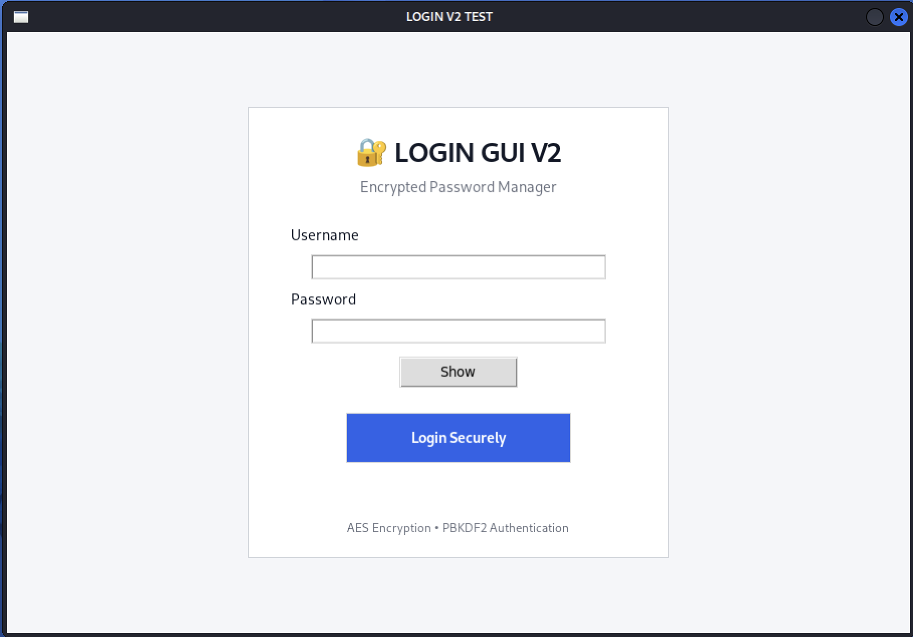
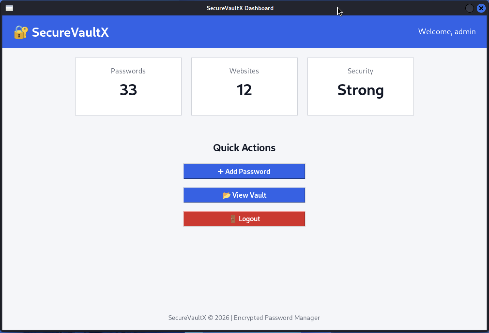
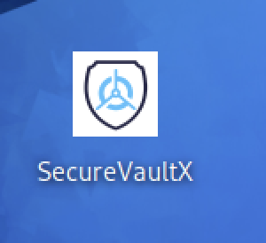
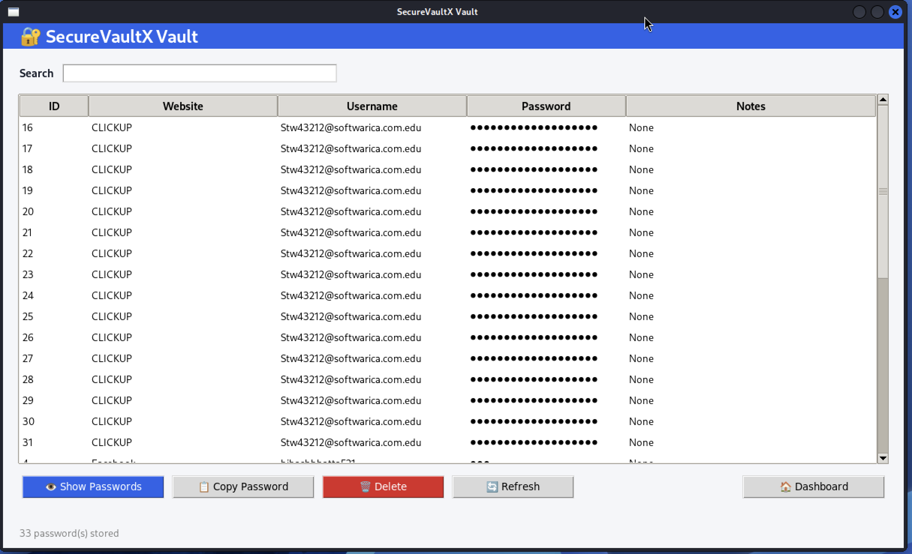

# SecureVaultX 🔐

SecureVaultX is an open-source password manager developed in Python using Tkinter and SQLite. The application securely stores user credentials using encryption and password hashing techniques.

## Features

- User Registration and Login System
- PBKDF2-HMAC-SHA256 Password Hashing
- AES/Fernet Encryption for Stored Passwords
- Secure Password Vault
- Password Generator
- Add, View, and Manage Saved Credentials
- GUI-based Interface using Tkinter
- Automatic Session Timeout (5 minutes)
- SQLite Database Storage

---

## Technologies Used

- Python 3
- Tkinter
- SQLite3
- Cryptography Library (Fernet)
- PBKDF2-HMAC-SHA256

---

## Project Structure

```text
SecureVaultX/
│
├── auth.py
├── crypto_utils.py
├── database.py
├── generate_key.py
├── login.py
├── main.py
├── register.py
├── theme.py
├── vault.py
├── requirements.txt
├── README.md
│
├── gui/
│   ├── login_gui_v2.py
│   ├── dashboard_gui_v2.py
│   ├── add_password_gui_v2.py
│   ├── view_vault_gui_v2.py
│   └── password_generator_gui.py
│
└── screenshots/
    ├── login.png
    ├── register.png
    ├── dashboard.png
    ├── add_password.png
    └── vault.png
```

---

# Installation

## 1. Clone the Repository

```bash
git clone https://github.com/aidennn0000/SecureVaultX.git
cd SecureVaultX
```

## 2. Create a Virtual Environment

```bash
python3 -m venv venv
source venv/bin/activate
```

## 3. Install Dependencies

```bash
pip install -r requirements.txt
```

---

# Running the Application

Launch the application using:

```bash
python3 gui/login_gui_v2.py
```

This starts the SecureVaultX graphical login interface.

---

# Example Usage

1. Register a new account.
2. Login using your master password.
3. Add new credentials to the vault.
4. View stored passwords securely.
5. Generate strong passwords using the password generator.

---

# Security Features

- PBKDF2-HMAC-SHA256 Password Hashing
- Salted Password Storage
- AES Encryption using Fernet
- Secure Session Management
- Automatic Logout after Inactivity
- Encrypted Credential Storage

---

# Screenshots

## Login Screen



## Registration Screen


## Dashboard



## Add Password



## Password Vault



---

# Author

**Bibash Bhatta**  
BSc (Hons) Ethical Hacking and Cyber Security

GitHub: https://github.com/aidennn0000
